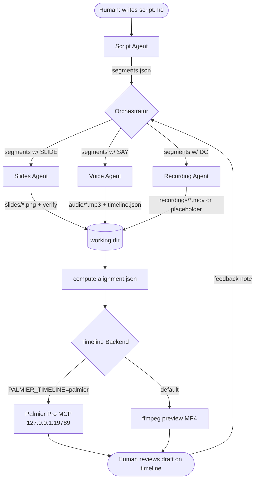
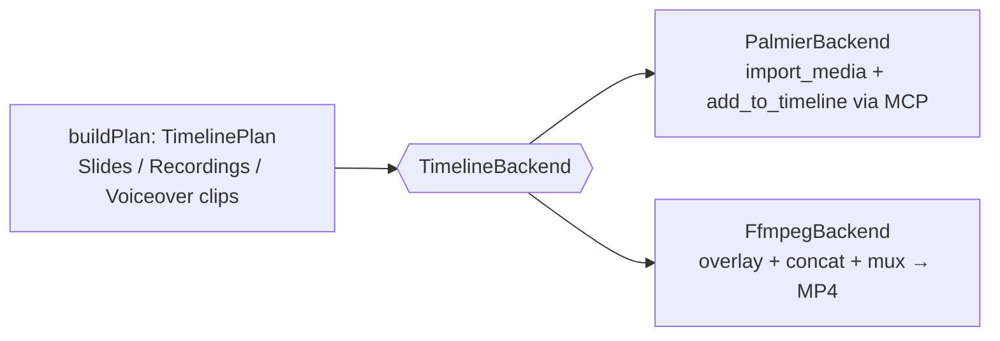
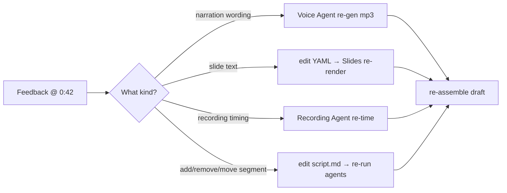

# Architecture

## Principle: agents coordinate through files, not calls

The Orchestrator and the four agents **never call each other directly**. Each one reads and
writes files in a per-lesson working directory (`~/hgdw-productions/<lesson>/`). This mirrors a
real edit bay: the script person, the slide designer, the VO artist, and the screen recorder all
drop assets into a shared folder, and an editor assembles them.



Slides and Voice run **in parallel** (independent inputs); Recording runs after, since its
duration target comes from the voiceover. Alignment is computed once all durations are known.

## The working directory (shared state)

```
~/hgdw-productions/<lesson>/
├── script.md                      # human-authored (Script Agent can draft)
├── segments.json                  # parsed script — the segment list
├── slides/<frameId>.png           # rendered, verified slide images
├── audio/individual/seg-<id>.mp3  # per-segment voiceover
├── timeline.json                  # per-segment durations + source (tts|estimate|silent)
├── alignment.json                 # cumulative start/end timestamps per segment
├── recordings/
│   ├── recording-manifest.json    # status per DO segment (recorded|placeholder|todo)
│   └── *.mov                       # screen recordings
└── videos/<lesson>-preview.mp4    # ffmpeg backend output
```

Each file has one owner. `timeline.json` is the **timing authority**; `alignment.json` is derived
from it and the segment order. Pure functions (`computeAlignment`, `buildPlan`, `parseScript`,
`resolveVoice`) are unit-tested.

## Pluggable timeline backend

This resolves the core tension: **Palmier Pro is macOS + localhost only**, but the system must
also run on a plain Mac (or Linux/cloud) for testing. Both backends consume the **same**
`TimelinePlan` produced by `buildPlan`, so placement logic is identical regardless of target.



| | Palmier backend | ffmpeg backend |
| --- | --- | --- |
| Target | iMac / Mac with Palmier Pro open | any machine |
| Output | live editable timeline (3 tracks) | `videos/<lesson>-preview.mp4` |
| Used for | final production | preview, testing, fallback |
| Selected by | `PALMIER_TIMELINE=palmier` | default |

## Track layout

| Track | Media | Rule |
| --- | --- | --- |
| 1 — Slides | PNG | Held for the segment's duration. |
| 2 — Recordings | `.mov` (or placeholder PNG) | Overlays/replaces the slide for `DO` segments. |
| 3 — Voiceover | MP3 | Per-segment TTS. Silent segments hold the slide with no audio. |

## Human feedback loop

Review happens on the **assembled draft**, by timestamp — not on individual files. A feedback
note maps to the agent that owns the fix:



## Anti-shortcut rules (enforced by the agents)

1. Never fake a screen recording — real footage or a **labeled placeholder**, never synthetic.
2. Never use ffmpeg `-shortest` (it truncates audio) — always encode to an explicit `-t <duration>`.
3. Never guess recording order from filenames — identify by content.
4. Never skip verification after a render/encode.
5. Never modify the script without human approval — flag, don't silently fix.
6. Verify each slide individually, never batched.

## Phase 2 (planned): Electron app

The CLI + engine is the core. A future Electron app wraps the **same engine** with a markdown
editor for `script.md` and a draft preview pane — no rewrite required. See
[`ROADMAP.md`](ROADMAP.md).
